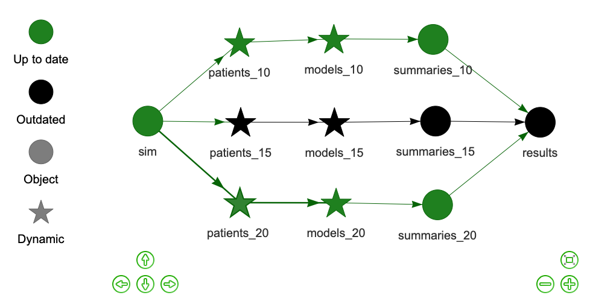

<style>
.inverse {
background-color: transparent;
text-shadow: 0 0 0px transparent;
}
.title-slide {
vertical-align: bottom !important; 
text-align: center !important;
}
.title-slide h1 {
position: absolute;
top: 0;
left: 0;
right: 0;
width: 100%;
line-height: 4em;
color: #666666;
}
.title-slide h3 {
line-height: 6em;
color: #666666;
}
.title-slide {
background-color: white;
background-image: url('images/logo.png');
background-repeat: no-repeat;
background-size: 25%;
}
.remark-slide-content:after {
content: "Copyright Eli Lilly and Company";
position: absolute;
bottom: -5px;
left: 10px;
height: 40px;
width: 100%;
font-family: Helvetica, Arial, sans-serif;
font-size: 0.7em;
color: gray;
background-repeat: no-repeat;
background-size: contain;
}
</style>

```{r, include = FALSE}
knitr::opts_chunk$set(
  eval = FALSE,
  collapse = TRUE,
  warning = FALSE,
  comment = "#>",
  fig.align = "center",
  fig.width = 10,
  fig.height = 7,
  out.width = "80%",
  out.height = "80%"
)
```

```{r, include = FALSE, message = FALSE}
options(
  warnPartialMatchArgs = FALSE,
  drake_clean_menu = FALSE,
  drake_make_menu = FALSE,
  htmltools.dir.version = FALSE
)
```

## Large statistical computation

* [Bayesian data analysis](https://mc-stan.org/)
* [Bayesian network meta-analysis](https://bookdown.org/MathiasHarrer/Doing_Meta_Analysis_in_R/bayesian-network-meta-analysis.html)
* [Graph-based multiple comparison procedures](https://github.com/kornl/gMCP)
* [Subgroup identification](https://cran.r-project.org/web/packages/TSDT/index.html)
* [Predictive modeling](http://appliedpredictivemodeling.com/computing)
* [Deep neural networks](https://keras.rstudio.com/)
* [PK/PD modeling](https://github.com/nlmixrdevelopment/nlmixr)
* Clinical trial simulation
* Target identification

???

Thank you all for coming, and thank you to R/Medicine for the opportunity to speak today.

In the life sciences, we develop ambitious computational workflows for Statistics and data science. There's a lot of Bayesian analysis, machine learning, simulation, and prediction. And we need to think about both efficiency and reproducibility right from the start.

---

## Common features

1. Heavy use of the [R language](https://www.r-project.org/).
2. Long runtimes.
3. Multiple sub-tasks.
4. Frequent changes to code and data.


<br>

<!--https://openclipart.org/detail/275842/sisyphus-overcoming-silhouette-->


???

Many of these projects require long runtimes. Methods like Markov chain Monte Carlo and deep neural nets are computationally expensive. It could take hours or even days just to fit a single model. That's fine if you're only going to run the project once, or at regularly scheduled times. But if the code is still under development, it's easy to get trapped in a vicious Sisyphean cycle.

---

## Interconnected tasks
<center>

</center>

???

A large workflow has a large number of moving parts. We have datasets that we preprocess or simulate, analyses of those datasets, and summaries of the analyses.

---

## Changes

<center>

</center>

???

If you change any one of these parts - whether it's a bugfix, a tweak to a model, or some new data -

---

## Consequences

<center>

</center>

???

Then everything that depends on it is no longer valid, and you need to rerun the computation to bring the results back up to date. This is seriously frustrating when you're in development and you're still making a constant stream of changes to code and data in real time. If every change means you need to rerun the project, there's no way the results can keep up...

---

## Pipeline tools and workflow managers

<center>

</center>

- Several exist already: [github.com/pditommaso/awesome-pipeline](https://github.com/pditommaso/awesome-pipeline).
- Most are language-agnostic or designed for Python or the shell.

???

...unless you use a pipeline tool. There are pipeline tools for production which resemble Apache Airflow, and there are pipeline tools for development which resemble GNU Make. Today, I'm going to focus on Make-like tools because those are the ones I think are designed for this part of the process. It's an action-packed space, and there are a lot of great options. But unfortunately, there's not a whole lot for R.

---

## What distinguishes `drake`?

<center>

</center>

.large[
* Fundamentally designed for R.
* Supports a clean, modular, function-oriented programming style.
* Abstracts files as R objects and automatically manages data.
]

???

That's where drake comes in. drake is a Make-like pipeline tool that is fundamentally designed for R. You can call it from an R session, it supports a clean, idiomatic, function-oriented style of programming, and it helps you store and retrieve your results. Most importantly, it gets you out of the Sisyphean loop of long computation, enhances reproducibility, and takes the frustration out of data science.

---

## Example: COVID-19 clinical trial simulation

* Motivation: design a randomized placebo-controlled phase 2 clinical trial of a potential new treatment of COVID-19.
* Goal: understand the operating characteristics of a 200-patient trial under different effect size scenarios.
* Enroll newly hospitalized patients (within 3 days of admission) who do not need supplemental oxygen or ventilation.
* Endpoint: days until the patient is discharged from the hospital.
* Efficacy rule: graduate to phase 3 only if Prob(hazard ratio (of hospital discharge) > 1.5) > 0.6.
* Simulation:
    1. Simulate time to event data from each arm (1 treatment and 1 placebo) from normal distributions (left-truncated right-censored).
    2. Analyze with a Bayesian survival model by [Zhou, Hanson, and Zhang](https://www.jstatsoft.org/article/view/v092i09) (2020; R package [`spBayesSurv`](https://cran.r-project.org/web/packages/spBayesSurv/index.html)).
    3. Aggregate over simulations to calculate operating characteristics.

???

Let's go to an example.

I am part of a capabilities team at Lilly, and much of our work revolves around the design and simulation of clinical trials. In the first several months of 2020, we helped design several trials for potential new treatments of COVID-19. We used simulation to explore the operating characteristics of these trials and determine features like sample size, primary endpoint, and even when the trial should stop.

Now this slide has a mock example clinical trial simulation study. It's not the actual simulation study for any one trial in particular, and it's oversimplified for pedagogical purposes. But it does represent how my team and I set up the computation for this kind of problem. We use drake a lot, and we use drake a lot in this way.

So this is a mock phase 2 trial, and the goal of the simulation is just to understand the trial's operating characteristics. So when is this trial going to claim the therapy works, and when is it going to claim that the therapy doesn't work? We want to design a trial that makes the correct decision without an unnecessarily large sample size. And one of the things we want to find out is whether 200 patients is a good enough.

Suppose we enroll newly hospitalized COVID-19 patients and measure the number of days until they're cleared to leave. We randomize half the patients to the treatment, half to placebo, and measure the drug's ability to shorten the hospital stay. For the end of the trial, there are multiple pre-built criteria to determine whether the therapy moves on to phase 3 studies, including patient safety, efficacy, and cost effectiveness. Suppose that we meet the efficacy criterion if the probability that the hazard ratio of hospital discharge exceeds one and a half is greater than 60%. 

We assess the design of this trial using simulation. First, we draw time to event data for each study arm from a distribution. Then, we analyze the simulated data and evaluate the efficacy rule using a Bayesian proportional hazards model. We repeat for many simulations, and we aggregate the results to figure out what efficacy decision the trial is likely to make under different scenarios.

---

## File structure

* Full source code: <https://github.com/wlandau/rmedicine2020>

```{r}
run.sh
run.R
_drake.R
sge.tmpl
R/
├── packages.R
├── functions.R
└── plan.R
```

???

So that's the background. Now how do we implement this? Let's have a look at the file system. We have R scripts to load our packages, custom functions, and something called a "drake plan", which I will get to later. We have a _drake.R script to configure the workflow, and some top-level "run" scripts just for convenience. We also have an sge.tmpl file to help us distribute the workload across multiple nodes of a Univa Grid Engine cluster.

---

## A nudge toward function-oriented programming

>    - Everything that exists is an object.
>    - Everything that happens is a function call.
>
> John Chambers

???

Most of the code we write is going to be in the form of custom functions. Now this may be unfamiliar to a lot of folks who are used to writing imperative code: numbered scripts, or everything in a bunch of R Markdown reports, etc. Functions scale much better for big stuff. A function is just a reusable set of instructions with multiple inputs and a single return value. Usually those inputs are explicitly defined and easy to create, and usually the function has an informative name. Functions are a fundamental built-in feature of almost every programming language we have, and they are particularly well suited to R, which was designed with formal functional programming principles in mind.

The most obvious use for functions is as a way to avoid copies of repeated code scattered throughout your project. So instead of copying and pasting the same code block everywhere, you just call the function. But functions are not just for code you want to reuse, they're for code you want to understand. Functions are custom shorthand. They make your work easier to read, understand, break down into manageable pieces, document, test, and validate. And that's why a function-oriented approach is superior to an ad-hoc script-oriented approach for a computationally intense simulation study that influences the conduct of serious clinical research.

---

## `functions.R`

```{r}
simulate_trial <- function(
  mean_control = 15,
  mean_treatment = 10,
  patients_per_arm = 100,
  censor = 30
) {
  bind_rows(
    simulate_arm(mean_control, censor, patients_per_arm, "control"),
    simulate_arm(mean_control, censor, patients_per_arm, "treatment")
  ) %>%
    mutate(
      patients_per_arm = patients_per_arm,
      mean_control = mean_control,
      mean_treatment = mean_treatment
    )
}
```

???

Most of our functions revolve around 3 kinds of tasks: preparing datasets, analyzing datasets, and summarizing analyses. This one is the top-level function of the data piece. It accepts easy-to-generate design parameters as arguments, and it returns a tidy data frame of simulated patient-level data. Inside the body, it calls another custom function called simulate_arm(), which we define elsewhere in the functions.R file.

---

## `functions.R`

```{r}
model_hazard <- function(patients, iterations) {
  samples <- map(seq_len(4), ~run_chain(patients, iterations))
  summarize_samples(samples, patients)
}

summarize_samples <- function(samples, patients) {
  hazard_ratio_list <- map(samples, ~as.mcmc(t(exp(.x$beta))))
  hazard_ratio <- unlist(hazard_ratio_list)
  tibble(
    prob_effect = mean(hazard_ratio > 1.5),
    median = median(hazard_ratio),
    psrf = gelman.diag(hazard_ratio_list, multivariate = FALSE)$psrf[, 1],
    patients_per_arm = patients$patients_per_arm[1],
    mean_control = patients$mean_control[1],
    mean_treatment = patients$mean_treatment[1]
  )
}

# And a few more...
```

???

Another custom function called model_hazard() actually fits the model, and it uses custom functions run_chain() and summarize_samples() to generate a one-row tidy data frame of results for a single simulated trial.

At this point, you already have something you can take away and apply. Even if you decide not to use drake, this function-oriented style still has a lot of value. However, if you're thinking about using drake, then converting to functions is almost all of the work. Once you've done that, you're already almost there. All you need now is to outline the specific steps of the computation in an object called a drake plan.

---

## `plan.R`

* A `drake` plan is an outline of the steps of a pipeline.

```{r}
plan <- drake_plan(
  sim = target(
    seq_len(1e3),
    hpc = FALSE
  ),
  patients = target(
    simulate_trial(
      mean_control = 20,
      mean_treatment = mean_treatment,
      patients_per_arm = 100,
      censor = 30
    ),
    dynamic = map(sim),
    transform = map(mean_treatment = c(10, 20)),
    format = "fst_tbl"
  ),
```

???

And here's how you define it. Inside the drake_plan() function, you list out things called targets. Each target is an individual step in the workflow. It has an informative name like "sim" or "patients", and it has a R command that invokes your custom functions and returns a value. drake has shorthand to define entire groups of targets, so here we generate a patient-level dataset for each treatment effect and each simulation rep.  

---

## `plan.R`

* A `drake` plan is an outline of the steps of a pipeline.

```{r}
  models = target(
    model_hazard(patients, 2e3),
    dynamic = map(patients),
    transform = map(patients, .id = mean_treatment),
    format = "fst_tbl"
  ),
  summaries = target(
    summarize_models(models),
    transform = map(models, .id = mean_treatment),
    format = "fst_tbl"
  ),
  results = target(
    bind_rows(summaries),
    transform = combine(summaries),
    format = "fst_tbl",
    hpc = FALSE
  )
)
```

???

And we have targets to analyze each dataset, summarize each effect size scenario, and combine the final results into a single data frame.

---

## Plan objects are data frames.

```{r, eval = TRUE, echo = FALSE}
plan <- drake::drake_plan(
  sim = target(
    seq_len(1e3),
    hpc = FALSE
  ),
  patients = target(
    simulate_trial(
      mean_control = 20,
      mean_treatment = mean_treatment,
      patients_per_arm = 100,
      censor = 30
    ),
    dynamic = map(sim),
    transform = map(mean_treatment = c(10, 20)),
    format = "fst_tbl"
  ),
  models = target(
    model_hazard(patients, 2e3),
    dynamic = map(patients),
    transform = map(patients, .id = mean_treatment),
    format = "fst_tbl"
  ),
  summaries = target(
    summarize_models(models),
    transform = map(models, .id = mean_treatment),
    format = "fst_tbl"
  ),
  results = target(
    bind_rows(summaries),
    transform = combine(summaries),
    format = "fst_tbl",
    hpc = FALSE
  )
)
```

```{r, eval = TRUE}
plan
```

???

The drake_plan() function doesn't actually run any of this work just yet. It simply returns a tidy data frame of the work we have planned. We've broken down the workflow into targets. We do this because we want drake to be able to skip some targets when they're already up to date, which is going to save us loads of runtime.

---

## Pipelines have directed acyclic graph representations

```{r}
plot(plan)
```


???

It's always good practice to visualize the dependency graph of the plan. drake has functions to do this for you, and it really demystifies how drake works. So here you see the flow of the project from left to right. We decide how many simulations we're going to run, then we simulate a bunch of patients, analyze them with models, and summarize them.

But how does drake know that the models depend on the patients? The order you write targets in the plan does not matter. drake knows that the patients depend on the models because the symbol "patients" is mentioned in the command for "models" in the plan. And in fact, we get one model for each patient-level dataset because of the "dynamic = map(patients)" call in the target. drake scans your commands and functions without actually running them it in order to look for changes and understand dependency relationships. This is called static code analysis.

---

## Define a top-level configuration script `_drake.R`.

```{r}
source("R/packages.R")
source("R/functions.R")
source("R/plan.R")
options(clustermq.scheduler = "sge", clustermq.template = "sge.tmpl")
drake_config(
  plan,
  parallelism = "clustermq",
  jobs = 100,
  caching = "worker",
  recover = TRUE,
  history = FALSE
)
```

???

To put it all together, we use a script called _drake.R. We load our packages, functions, and plan, we set options to farm out targets to the cluster, and we end with a call to drake_config(). drake_config() explicitly accepts the plan and workflow settings, and it implicitly accepts the environment where the functions are defined.

---

## Run the pipeline with `r_make()`

```{r}
r_make()
#> ▶ dynamic patients_10
#> > subtarget patients_10_0b3474bd
#> > subtarget patients_10_b2a5c9b8
# ...
#> ■ finalize patients_10
#> ▶ dynamic patients_20
#> ▶ dynamic models_10
#> ▶ dynamic models_20
#> ▶ target summaries_10
#> ▶ target summaries_20
#> ▶ target results
```

???

To actually run the workflow, we use a function called r_make(). r_make() creates a clean new reproducible R process, runs _drake.R to populate the new session, resolves the dependency graph, runs the correct targets in the correct order from the dependency graph, and writes the return values to storage.

Throughout this whole process, drake distributes targets across the Univa Grid Engine cluster we configured it with. drake automatically knows from the graph which targets can run in parallel and which need to wait for dependencies. So you don't need to worry out how to parallelize your code, you can focus more on the content of the methodology.

---

## Inspect the results

```{r}
> readd(results)
#> # A tibble: 2 x 6
#>   prob_success mean_treatment mean_control patients_per_arm median max_psrf
#>          <dbl>          <dbl>        <dbl>            <dbl>  <dbl>    <dbl>
#> 1        0.996             10           20              100  2.36      1.03
#> 2        0.001             20           20              100  0.997     1.02
```

???

Afterwards, all the targets are in storage. There's a special key-value store in a hidden .drake/ folder, and drake has functions loadd() and readd() to retrieve data from the store. drake abstracts artifacts as ordinary objects. You don't need to worry about where these files are located, you just need to know the target names.

Here is the first round of operating characteristics. We have a strong scenario that assumes the drug cuts hospitalization time in half, and we have a null scenario that assumes no efficacy at all. We meet the efficacy criterion in the former, but not in the latter. This aligns with prior expectations, so it's a sign the code is working. But it's not useful yet because it only states the obvious. We need to add more scenarios to understand how this trial behaves. In practice, we reach out cross-functionally and comb the literature of the disease state to come up with meaningful scenarios. Maybe we set one effect size scenario right at the effect of interest in the efficacy rule, another effect size scenario right at standard of care (or the most promising therapy currently under development).

---

## Add a new effect size scenario

```{r}
plan <- drake_plan(
  # ...
  patients = target(
    simulate_trial(
      mean_control = 20,
      mean_treatment = mean_treatment,
      patients_per_arm = 100,
      censor = 30
    ),
    dynamic = map(sim),
    transform = map(mean_treatment = c(10, 15, 20)), #<<
    format = "fst_tbl"
  ),
  # ...
```

???

In any case, when we want to add a scenario, we go back to the plan and add new targets. In this plan, we add a new mean response for the treatment arm.

---

## The old targets are still up to date.

```{r}
r_vis_drake_graph()
```



???

When we visualize the graph this time, we see our new targets. We also see that the targets we previously ran are still up to date because we did not change any of the data, commands, for functions they depend on. Only the new targets are outdated, as well as the final results target which depends on everything.


---

## Only the new or outdated targets run this time.

```{r}
r_make()
#> ▶ dynamic patients_15
#> > subtarget patients_15_0b3474bd
#> > subtarget patients_15_b2a5c9b8
#> ...
#> ■ finalize patients_15
#> ▶ dynamic models_15
#> > subtarget models_15_988dca98
#> > subtarget models_15_de6279d2
#> ...
#> ■ finalize models_15
#> ▶ target summaries_15
#> ▶ target results
```

???

So when we run r_make() again, only the new scenarios actually get computed. drake skips the rest and saves us a whole lot of runtime. That's 2000 Bayesian models we don't need to fit.

---

## New combined results

```{r}
readd(results)
#> # A tibble: 3 x 6
#>   prob_success mean_treatment mean_control patients_per_arm median max_psrf
#>          <dbl>          <dbl>        <dbl>            <dbl>  <dbl>    <dbl>
#> 1        0.996             10           20              100  2.36      1.03
#> 2        0.503             15           20              100  1.56      1.03
#> 3        0.001             20           20              100  0.997     1.02
```

???

And our final results automatically updated with the results we have so far. That new scenario is in the middle.

Now I didn't show this, but the dependency graph also takes into account functions mentioned in the commands of the plan, as well as functions nested inside those functions. And if any one of those functions changes, drake automatically reruns the targets they depend on and skips the targets that are still up to date. It also does this with data files. You can tell drake to track input and output files with special language. So drake keeps up with the constant stream of changes you make to code and data during development, and it keeps results up to date without wasting time.

---

## Tangible evidence of reproducibility.

```{r}
r_make()
#> ✓ All targets are already up to date.
```

???

At the end of the day, drake can tell you if all your targets are up to date. This is tangible evidence that your output matches the code and data it's supposed to come from. It's evidence that someone else running the same code would get the same results. That's reproducibility. 

---

## Links

- Development repository: <https://github.com/ropensci/drake>
- Full user manual <https://books.ropensci.org/drake/>
- Reference website: <https://docs.ropensci.org/drake>
- Hands-on workshop: <https://github.com/wlandau/learndrake>
- Code examples: <https://github.com/wlandau/drake-examples>
- Discuss at rOpenSci.org: <https://discuss.ropensci.org>

???

You can learn more about drake in the online manual, reference website, public examples, or online workshop.

---

## The online workshop

1. Sign up for a free account at <https://rstudio.cloud>.
2. Log into <https://rstudio.cloud/project/627076>.
3. Work through the R notebooks in order.

Topic | Notebook
---|---
Custom functions | [`1-functions/1-functions.Rmd`](https://github.com/wlandau/learndrake/blob/master/inst/notebooks/1-functions/1-functions.Rmd)
`drake` plans | [`2-plans/2-plans.Rmd`](https://github.com/wlandau/learndrake/blob/master/inst/notebooks/2-plans/2-plans.Rmd)
Changing workflows | [`3-changes/3-changes.Rmd`](https://github.com/wlandau/learndrake/blob/master/inst/notebooks/3-changes/3-changes.Rmd)
Static branching | [`4-static/4-static.Rmd`](https://github.com/wlandau/learndrake/blob/master/inst/notebooks/4-static/4-static.Rmd)
Dynamic branching | [`5-dynamic/5-dynamic.Rmd`](https://github.com/wlandau/learndrake/blob/master/inst/notebooks/5-dynamic/5-dynamic.Rmd)
Files and R Markdown | [`6-files/6-files.Rmd`](https://github.com/wlandau/learndrake/blob/master/inst/notebooks/6-files/6-files.Rmd)

* Source materials: <https://github.com/wlandau/learndrake>

???

The workshop is fully online and interactive, and you can take it on your own. Just sign up for a free account at RStudio Cloud, open the workspace in a web browser, and work through the R notebooks and Shiny apps in order. The exercises gradually build up a machine learning project and explore the features and concepts of drake as the project expands.

---

## Thanks

<table style = "border: none">
<tr>
<td>
<br>
<ul>

<li><a href = "https://github.com/maelle">Maëlle Salmon</a></li>
<li><a href = "https://github.com/benmarwick">Ben Marwick</a></li>
<li><a href = "https://github.com/jules32">Julia Lowndes</a></li>
<li><a href = "https://github.com/gothub">Peter Slaughter</a></li>
<li><a href = "https://github.com/jennybc">Jenny Bryan</a></li>
<li><a href = "https://github.com/richfitz">Rich FitzJohn</a></li>
<li><a href = "https://github.com/stefaniebutland">Stefanie Butland</a></li>
</ul>
</td>
<td>
<ul>
<li><a href = "https://github.com/jarad">Jarad Niemi</a></li>
<li><a href = "https://github.com/krlmlr">Kirill Müller</a></li>
<li><a href = "https://github.com/HenrikBengtsson">Henrik Bengtsson</a></li>
<li><a href = "https://github.com/mschubert">Michael Schubert</a></li>
<li><a href = "https://github.com/kendonB">Kendon Bell</a></li>
<li><a href = "https://github.com/milesmcbain">Miles McBain</a></li>
<li><a href = "https://github.com/pat-s">Patrick Schratz</a></li>
<li><a href = "https://github.com/AlexAxthelm">Alex Axthelm</a></li>
<li><a href = "https://github.com/dapperjapper">Jasper Clarkberg</a></li>
<li><a href = "https://github.com/tiernanmartin">Tiernan Martin</a></li>
<li><a href = "https://github.com/BListyg">Ben Listyg</a></li>
<li><a href = "https://github.com/tjmahr">TJ Mahr</a></li>
<li><a href = "https://github.com/bpbond">Ben Bond-Lamberty</a></li>
<li><a href = "https://github.com/tmastny">Tim Mastny</a></li>
<li><a href = "https://github.com/billdenney">Bill Denney</a></li>
<li><a href = "https://github.com/aedobbyn">Amanda Dobbyn</a></li>
<li><a href = "https://github.com/dfalster">Daniel Falster</a></li>
<li><a href = "https://github.com/rkrug">Rainer Krug</a></li>
<li><a href = "https://github.com/bmchorse">Brianna McHorse</a></li>
<li><a href = "https://github.com/mrchypark">Chan-Yub Park</a></li>
</ul>
</td>
</tr>
</table>

???

I owe many thanks to the R community, especially rOpenSci, for the vibrant discussion and widespread adoption that made drake the package it is today. So many people contributed insightful ideas and informed me about problems I didn't know existed, and this active participation was the real fuel for development over the past four years.

---

## rOpenSci use cases

- Use [`drake`](https://github.com/ropensci/drake)? Share your use case at <https://ropensci.org/usecases>.

<center>

</center>

???

drake is a peer-reviewed rOpenSci package. If you would like to share your use case, please consider reaching out at ropensci.org/usecases. 

---

## References

1. Landau, William Micahel. "The drake R package: a pipeline toolkit for reproducibility and high-performance computing." *Jounral of Open Source Software*, 3 (21), 2018. [doi:10.21105/joss.00550](https://joss.theoj.org/papers/10.21105/joss.00550) 
2. Zhou, Haiming and Hanson, Timothy and Zhang, Jiajia. "spBayesSurv: Fitting Bayesian Survival Models Using R". `Journal of Statistical Software`, 92 (9), 2020. [doi:10.18637/jss.v092.i09](https://doi.org/10.18637/jss.v092.i09).
