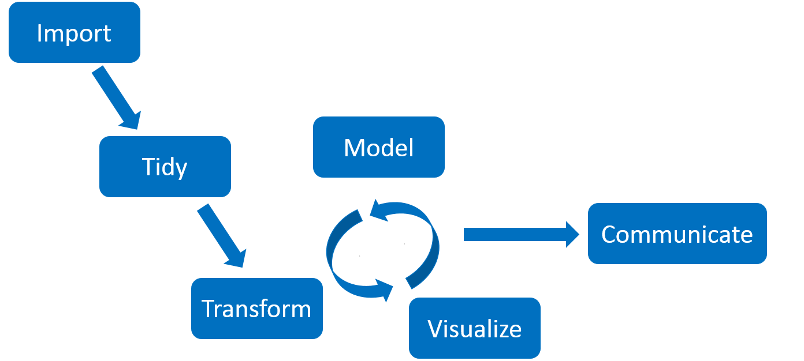
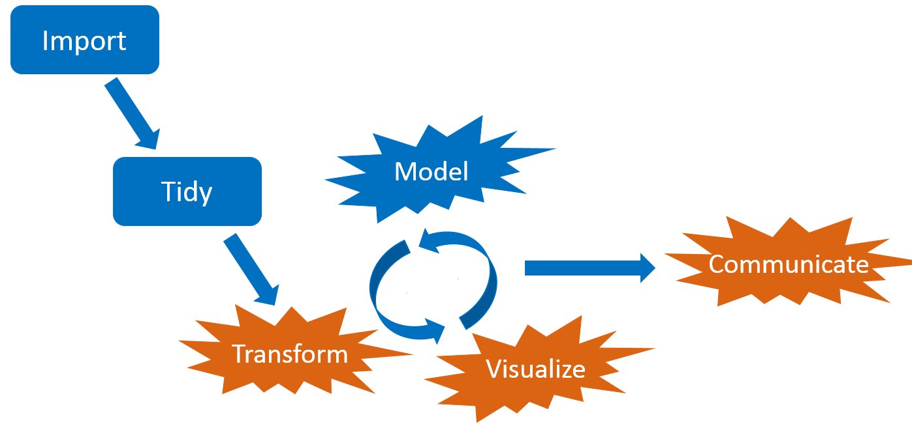

<style>
.inverse {
background-color: transparent;
text-shadow: 0 0 0px transparent;
}
.title-slide {
vertical-align: bottom !important; 
text-align: center !important;
}
.title-slide h1 {
position: absolute;
top: 0;
left: 0;
right: 0;
width: 100%;
line-height: 4em;
color: #666666;
}
.title-slide h3 {
line-height: 6em;
color: #666666;
}
.title-slide {
background-color: white;
background-image: url('images/logo.png');
background-repeat: no-repeat;
background-size: 25%;
}
.remark-slide-content:after {
content: "Copyright Eli Lilly and Company";
position: absolute;
bottom: -5px;
left: 10px;
height: 40px;
width: 100%;
font-family: Helvetica, Arial, sans-serif;
font-size: 0.7em;
color: gray;
background-repeat: no-repeat;
background-size: contain;
}
</style>

```{r, include = FALSE}
knitr::opts_chunk$set(
  eval = FALSE,
  collapse = TRUE,
  warning = FALSE,
  comment = "#>",
  fig.align = "center",
  fig.width = 10,
  fig.height = 7,
  out.width = "80%",
  out.height = "80%"
)
```

```{r, include = FALSE, message = FALSE}
options(
  warnPartialMatchArgs = FALSE,
  drake_clean_menu = FALSE,
  drake_make_menu = FALSE,
  htmltools.dir.version = FALSE
)
```

## Large statistical computation

* [Bayesian data analysis](https://mc-stan.org/)
* [Bayesian network meta-analysis](https://bookdown.org/MathiasHarrer/Doing_Meta_Analysis_in_R/bayesian-network-meta-analysis.html)
* [Graph-based multiple comparison procedures](https://github.com/kornl/gMCP)
* [Subgroup identification](https://cran.r-project.org/web/packages/TSDT/index.html)
* [Predictive modeling](http://appliedpredictivemodeling.com/computing)
* [Deep neural networks](https://keras.rstudio.com/)
* [PK/PD modeling](https://github.com/nlmixrdevelopment/nlmixr)
* Clinical trial simulation
* Target identification

---

## Common features

1. Heavy use of the [R language](https://www.r-project.org/).
2. Long runtimes.
3. Multiple sub-tasks.
4. Frequent changes to code and data.


<br>

<!--https://openclipart.org/detail/275842/sisyphus-overcoming-silhouette-->

---

## Interconnected tasks
<center>

</center>

---

## Changes

<center>

</center>

---

## Consequences

<center>

</center>

---

## Pipeline tools and workflow managers

<center>

</center>

- Several exist already: [github.com/pditommaso/awesome-pipeline](https://github.com/pditommaso/awesome-pipeline).
- Most are language-agnostic or designed for Python or the shell.

---

## What distinguishes `drake`?

<center>

</center>

.large[
* Fundamentally designed for R.
* Supports a clean, modular, function-oriented programming style.
* Abstracts files as R objects and automatically manages data.
]

---

## Example: COVID-19 clinical trial simulation

* Motivation: design a randomized placebo-controlled phase 2 clinical trial of a potential new treatment of COVID-19.
* Goal: understand the operating characteristics of a 200-patient trial under different effect size scenarios.
* Patient population: hospitalized patients with moderate symptoms.
* Endpoint: days until the patient is discharged from the hospital.
* Decision: graduate to phase 3 at the end of the study if Prob(hazard ratio (of hospital discharge) > 1.5) > 0.6.
* Simulation:
    1. Simulate time to event data from each arm (1 treatment and 1 placebo) from normal distributions (left-truncated right-censored).
    2. Analyze with a Bayesian survival model by [Zhou, Hanson, and Zhang](https://www.jstatsoft.org/article/view/v092i09) (2020; R package [`spBayesSurv`](https://cran.r-project.org/web/packages/spBayesSurv/index.html)).
    3. Aggregate over simulations to calculate operating characteristics.

---

## File structure

* Full source code: <https://github.com/wlandau/rmedicine2020>

```{r}
run.sh
run.R
_drake.R
sge.tmpl
R/
├── packages.R
├── functions.R
└── plan.R
```

---

## A nudge toward function-oriented programming

>    - Everything that exists is an object.
>    - Everything that happens is a function call.
>
> John Chambers

---

## `functions.R`

```{r}
simulate_trial <- function(
  mean_control = 15,
  mean_treatment = 10,
  patients_per_arm = 100,
  censor = 30
) {
  bind_rows(
    simulate_arm(mean_control, censor, patients_per_arm, "control"),
    simulate_arm(mean_control, censor, patients_per_arm, "treatment")
  ) %>%
    mutate(
      patients_per_arm = patients_per_arm,
      mean_control = mean_control,
      mean_treatment = mean_treatment
    )
}
```

---

## `functions.R`

```{r}
model_hazard <- function(patients, iterations) {
  samples <- map(seq_len(4), ~run_chain(patients, iterations))
  summarize_samples(samples, patients)
}

summarize_samples <- function(samples, patients) {
  hazard_ratio_list <- map(samples, ~as.mcmc(t(exp(.x$beta))))
  hazard_ratio <- unlist(hazard_ratio_list)
  tibble(
    prob_effect = mean(hazard_ratio > 1.5),
    median = median(hazard_ratio),
    psrf = gelman.diag(hazard_ratio_list, multivariate = FALSE)$psrf[, 1],
    patients_per_arm = patients$patients_per_arm[1],
    mean_control = patients$mean_control[1],
    mean_treatment = patients$mean_treatment[1]
  )
}

# And a few more...
```

---

## `plan.R`

* A `drake` plan is an outline of the steps of a pipeline.

```{r}
plan <- drake_plan(
  sim = target(
    seq_len(1e3),
    hpc = FALSE
  ),
  patients = target(
    simulate_trial(
      mean_control = 20,
      mean_treatment = mean_treatment,
      patients_per_arm = 100,
      censor = 30
    ),
    dynamic = map(sim),
    transform = map(mean_treatment = c(10, 15, 20)),
    format = "fst_tbl"
  ),
```

---

## `plan.R`

* A `drake` plan is an outline of the steps of a pipeline.

```{r}
  models = target(
    model_hazard(patients, 2e3),
    dynamic = map(patients),
    transform = map(patients, .id = mean_treatment),
    format = "fst_tbl"
  ),
  summaries = target(
    summarize_models(models),
    transform = map(models, .id = mean_treatment),
    format = "fst_tbl"
  ),
  results = target(
    bind_rows(summaries),
    transform = combine(summaries),
    format = "fst_tbl",
    hpc = FALSE
  )
)
```

---

## Plan objects are data frames.

```{r, eval = TRUE, echo = FALSE}
plan <- drake::drake_plan(
  sim = target(
    seq_len(1e3),
    hpc = FALSE
  ),
  patients = target(
    simulate_trial(
      mean_control = 20,
      mean_treatment = mean_treatment,
      patients_per_arm = 100,
      censor = 30
    ),
    dynamic = map(sim),
    transform = map(mean_treatment = c(10, 15, 20)),
    format = "fst_tbl"
  ),
  models = target(
    model_hazard(patients, 2e3),
    dynamic = map(patients),
    transform = map(patients, .id = mean_treatment),
    format = "fst_tbl"
  ),
  summaries = target(
    summarize_models(models),
    transform = map(models, .id = mean_treatment),
    format = "fst_tbl"
  ),
  results = target(
    bind_rows(summaries),
    transform = combine(summaries),
    format = "fst_tbl",
    hpc = FALSE
  )
)
```

```{r, eval = TRUE}
plan
```

---

## Pipelines are directed acyclic graphs

```{r}
plot(plan)
```


---

## Define a top-level configuration script `_drake.R`.

```{r}
source("R/packages.R")
source("R/functions.R")
source("R/plan.R")
options(clustermq.scheduler = "sge", clustermq.template = "sge.tmpl")
drake_config(
  plan,
  parallelism = "clustermq",
  jobs = 1000,
  caching = "worker",
  recover = TRUE,
  history = FALSE
)
```

---

## Run the pipeline with `r_make()`

```{r}
r_make()
#> ▶ dynamic patients_10
#> > subtarget patients_10_0b3474bd
#> > subtarget patients_10_b2a5c9b8
# ...
#> ■ finalize patients_10
#> ▶ dynamic patients_20
#> ▶ dynamic models_10
#> ▶ dynamic models_20
#> ▶ target summaries_10
#> ▶ target summaries_20
#> ▶ target results
```

---

## Inspect the results

```{r}
> readd(results)
#> # A tibble: 2 x 6
#>   prob_success mean_treatment mean_control patients_per_arm median max_psrf
#>          <dbl>          <dbl>        <dbl>            <dbl>  <dbl>    <dbl>
#> 1        0.996             10           20              100  2.36      1.03
#> 2        0.001             20           20              100  0.997     1.02
```

---

## Add a new effect size scenario

```{r}
plan <- drake_plan(
  # ...
  patients = target(
    simulate_trial(
      mean_control = 20,
      mean_treatment = mean_treatment,
      patients_per_arm = 100,
      censor = 30
    ),
    dynamic = map(sim),
    transform = map(mean_treatment = c(10, 15, 20)), #<<
    format = "fst_tbl"
  ),
  # ...
```

---

## The old targets are still up to date.

```{r}
r_vis_drake_graph()
```


---

## Only the new or outdated targets run this time.

```{r}
r_make()
#> ▶ dynamic patients_15
#> > subtarget patients_15_0b3474bd
#> > subtarget patients_15_b2a5c9b8
#> ...
#> ■ finalize patients_15
#> ▶ dynamic models_15
#> > subtarget models_15_988dca98
#> > subtarget models_15_de6279d2
#> ...
#> ■ finalize models_15
#> ▶ target summaries_15
#> ▶ target results
```

---

## New combined results

```{r}
readd(results)
#> # A tibble: 3 x 6
#>   prob_success mean_treatment mean_control patients_per_arm median max_psrf
#>          <dbl>          <dbl>        <dbl>            <dbl>  <dbl>    <dbl>
#> 1        0.996             10           20              100  2.36      1.03
#> 2        0.503             15           20              100  1.56      1.03
#> 3        0.001             20           20              100  0.997     1.02
```

---

## Tangible evidence of reproducibility.

```{r}
r_make()
#> ✓ All targets are already up to date.
```

---

## Links

- Development repository: <https://github.com/ropensci/drake>
- Full user manual <https://books.ropensci.org/drake/>
- Reference website: <https://docs.ropensci.org/drake>
- Hands-on workshop: <https://github.com/wlandau/learndrake>
- Code examples: <https://github.com/wlandau/drake-examples>
- Discuss at rOpenSci.org: <https://discuss.ropensci.org>

---

## The online workshop

1. Sign up for a free account at <https://rstudio.cloud>.
2. Log into <https://rstudio.cloud/project/627076>.
3. Work through the R notebooks in order.

Topic | Notebook
---|---
Custom functions | [`1-functions/1-functions.Rmd`](https://github.com/wlandau/learndrake/blob/master/inst/notebooks/1-functions/1-functions.Rmd)
`drake` plans | [`2-plans/2-plans.Rmd`](https://github.com/wlandau/learndrake/blob/master/inst/notebooks/2-plans/2-plans.Rmd)
Changing workflows | [`3-changes/3-changes.Rmd`](https://github.com/wlandau/learndrake/blob/master/inst/notebooks/3-changes/3-changes.Rmd)
Static branching | [`4-static/4-static.Rmd`](https://github.com/wlandau/learndrake/blob/master/inst/notebooks/4-static/4-static.Rmd)
Dynamic branching | [`5-dynamic/5-dynamic.Rmd`](https://github.com/wlandau/learndrake/blob/master/inst/notebooks/5-dynamic/5-dynamic.Rmd)
Files and R Markdown | [`6-files/6-files.Rmd`](https://github.com/wlandau/learndrake/blob/master/inst/notebooks/6-files/6-files.Rmd)

* Source materials: <https://github.com/wlandau/learndrake>

---

## Thanks

<table style = "border: none">
<tr>
<td>
<br>
<ul>

<li><a href = "https://github.com/maelle">Maëlle Salmon</a></li>
<li><a href = "https://github.com/benmarwick">Ben Marwick</a></li>
<li><a href = "https://github.com/jules32">Julia Lowndes</a></li>
<li><a href = "https://github.com/gothub">Peter Slaughter</a></li>
<li><a href = "https://github.com/jennybc">Jenny Bryan</a></li>
<li><a href = "https://github.com/richfitz">Rich FitzJohn</a></li>
<li><a href = "https://github.com/stefaniebutland">Stefanie Butland</a></li>
</ul>
</td>
<td>
<ul>
<li><a href = "https://github.com/jarad">Jarad Niemi</a></li>
<li><a href = "https://github.com/krlmlr">Kirill Müller</a></li>
<li><a href = "https://github.com/HenrikBengtsson">Henrik Bengtsson</a></li>
<li><a href = "https://github.com/mschubert">Michael Schubert</a></li>
<li><a href = "https://github.com/kendonB">Kendon Bell</a></li>
<li><a href = "https://github.com/milesmcbain">Miles McBain</a></li>
<li><a href = "https://github.com/pat-s">Patrick Schratz</a></li>
<li><a href = "https://github.com/AlexAxthelm">Alex Axthelm</a></li>
<li><a href = "https://github.com/dapperjapper">Jasper Clarkberg</a></li>
<li><a href = "https://github.com/tiernanmartin">Tiernan Martin</a></li>
<li><a href = "https://github.com/BListyg">Ben Listyg</a></li>
<li><a href = "https://github.com/tjmahr">TJ Mahr</a></li>
<li><a href = "https://github.com/bpbond">Ben Bond-Lamberty</a></li>
<li><a href = "https://github.com/tmastny">Tim Mastny</a></li>
<li><a href = "https://github.com/billdenney">Bill Denney</a></li>
<li><a href = "https://github.com/aedobbyn">Amanda Dobbyn</a></li>
<li><a href = "https://github.com/dfalster">Daniel Falster</a></li>
<li><a href = "https://github.com/rkrug">Rainer Krug</a></li>
<li><a href = "https://github.com/bmchorse">Brianna McHorse</a></li>
<li><a href = "https://github.com/mrchypark">Chan-Yub Park</a></li>
</ul>
</td>
</tr>
</table>

---

## rOpenSci use cases

- Use [`drake`](https://github.com/ropensci/drake)? Share your use case at <https://ropensci.org/usecases>.

<center>

</center>

---

## References

1. Landau, William Micahel. "The drake R package: a pipeline toolkit for reproducibility and high-performance computing." *Jounral of Open Source Software*, 3 (21), 2018. [doi:10.21105/joss.00550](https://joss.theoj.org/papers/10.21105/joss.00550) 
2. Zhou, Haiming and Hanson, Timothy and Zhang, Jiajia. "spBayesSurv: Fitting Bayesian Survival Models Using R". `Journal of Statistical Software`, 92 (9), 2020. [doi:10.18637/jss.v092.i09](https://doi.org/10.18637/jss.v092.i09).
